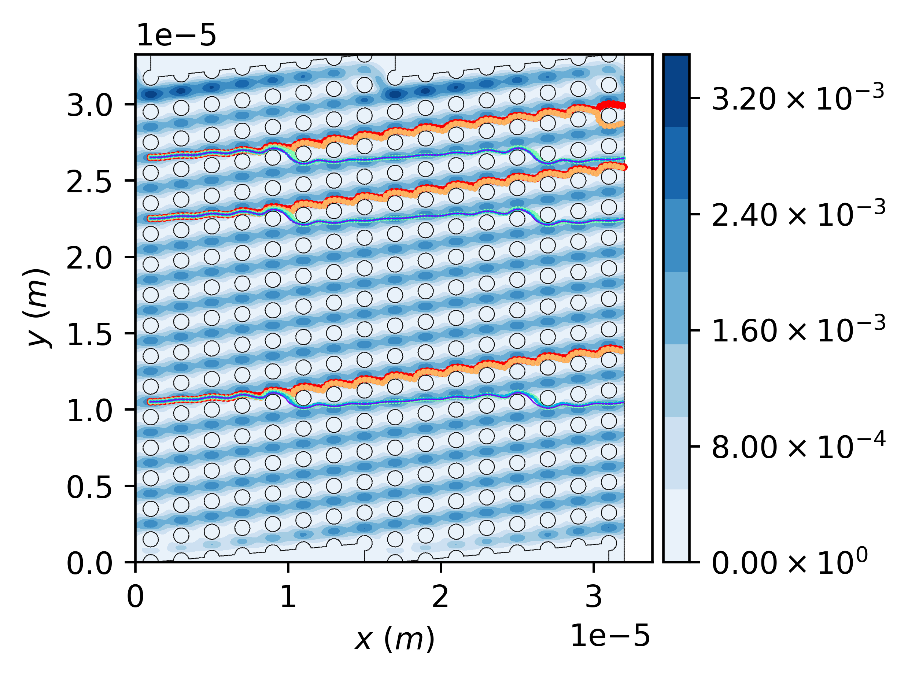
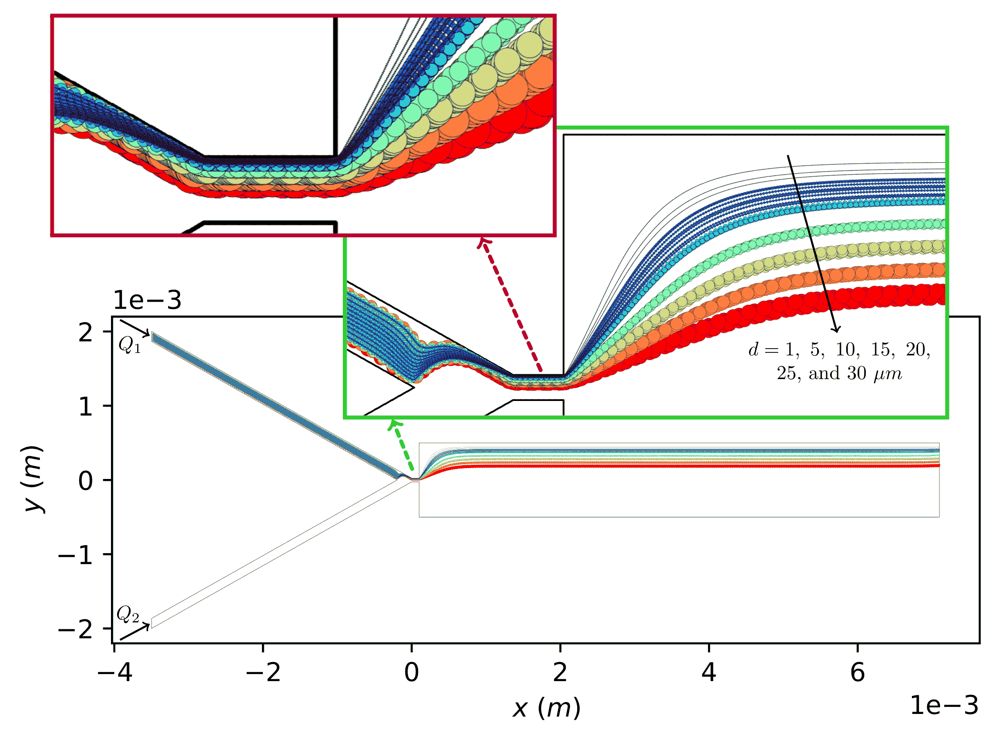

DLD             |  Pinched flow
:-------------------------:|:-------------------------:
  |  


> [!NOTE]
> The example files as well as an introductory manual should be accessible from [https://utexas.box.com/v/am-fspt-docs](https://utexas.box.com/v/am-fspt-docs).

# Overview
This is a library for simulating motion of finite-size particles in fluid flow. The underlying algorithm takes into account interactions between particles and solid objects existing inside computational domain. The method includes a computationally-efficient, two-step search algorithm to mitigate the efficiency problems associated with the auxiliary structured grid (ASG) search algorithm when pinpointing hosting cell for a given location, in conjunction with a boundary condition to capture interactions between particle and solid objects.

## Importance
Particle-wall interactions play a crucially important role in different applications such as microfluidic devices for
- cell sorting,
- particle separation,
- entire class of hydrodynamic filtration and its derivatives, etc.

Yet, accurate implementation of particle-wall interactions is not trivial when working with currently available algorithms/packages as they typically work with point-wise particles.

## Current features
Some of the key features of the library are listed below.
> [!TIP]
> - **One-way coupling;** fluid flow is not affected by particles.
> - **Hybrid unstructured mesh** consisting of triangular and/or quadrilateral cells can be processed.
> - **Ansys mesh** can be processed.
> - An **adaptive time-step integration** is implemented, wherein an appropriate time step is calculated based on local/instantaneous Stokes number of particle:
>   - **Small Stokes regime**: particle is assumed to instantaneously follow local streamline of fluid flow by using one of the available integration schemes:
>     - **Explicit Euler scheme**.
>     - **Runge-Kutta**.
>   - **Large Stokes regime:** The **velocity Verlet** is used to take into account **inertia effects** and to update instantaneous acceleration, velocity, and position of particle.
> - **Particle-wall collision** can be modeled with various values of **elastic reflection coefficient** between 0 (pure inelastic) and 1 (pure elastic).
> - **One or multiple particles** can be introduced in various fashions:
>   - **Point source** for one or multiple particles with various attributes, _e.g._, diameter, density, etc.
>   - **Streakline** for multiple particles with similar or various attributes, _e.g._, diameter, density, etc.
>   - **Arbitrary configurations** from a text file with various attributes, _e.g._, diameter, density, injection speed, etc.
> - **Multi-thread:** A relatively large number of particles can be processed in parallel by using the OpenMP API.

> [!WARNING]
> The library has currently multiple limitations including:
> - It runs two-dimensional modeling. So, three-dimensional problems cannot be solved. 
> - It does not have a solver for fluid flow. Thus, fluid flow equations need to be solved, first, by using other packages, _e.g._, OpenFOAM, Ansys, COMSOL, etc., before using the library.
> - Periodic boudnary condition for particle motion is not available.
> - Only Ansys format is currently supported for mesh and fluid flow solution files.
> - The post processing and visualization are not currently available in the library. A user would need to take the particle trajectory files and use other packages for those purposes.

# Installation
There are a few different options to install the library as described in the following.

## Using Installer
Use an appropriate installer from the `./build/installer` directory to install the library on your system. The path of executable can then be added to the `path` variable of system. The path of executable can be something like `C:\Program Files\pt\bin` on Windows OS.

## Using CMake

**Note:** You need to have `CMake` installed on your system for this option. You can get it from [CMake website](https://cmake.org/download/).

- Download the library and navigate to its root directory and create a build directory as needed.

```
mkdir build
```

- Navigate to the build directory and run cmake to configure the project and generate a native build system.

```
cd build
cmake ..\cpt
```

- Call the build system to actually compile/link the project:

```
cmake --build .
```

- Add the path of executable (build directory) to the `path` variable.

> [!NOTE]
> There are a few different configurations you can create by modifying the aforementioned commands as discussed below:

### Different configurations of project: Linux
  To specify configuration (debug, release, etc.), pass an appropriate argument when configuring the project. For example:

```
cmake -DCMAKE_BUILD_TYPE=Debug ..\cpt
```

or

```
cmake -DCMAKE_BUILD_TYPE=Release ..\cpt
```

### Different configurations of project: Windows
  Configuration can be done during the build step by passing an appropriate `--config` flag:

```
cmake --build . --config Debug
```

or

```
cmake --build . --config Release
```
  
  > [!IMPORTANT]
  > Not specifying the `--config` flag should lead to `debug` config by default, which is generally much slower than the `Release` config.


# Getting Started
You can run a simulation from your terminal using the following syntax: 

```
`pt --fname <config_file>`
```

or 

```
`pt -F <config_file>`
```

wherein `<config_file>` refers to config file consisting of appropriate key-value pairs to configure the simulation.

**Note:** When the config file is not passed explicitly, _i.e._, running the command `pt`, it is assumed that a config file named `config.txt` resides in the current directory.

> [!TIP]
> Please see the [Examples Section](#Examples) for more details.

# How to contribute code

Follow these steps to submit your code contribution.

## Step 1. Open an issue

Before making any changes, we recommend opening an issue (if one doesn't already exist) and discussing your proposed changes. This way, we can give you feedback and validate the proposed changes.

## Step 2. Make code changes

To make code changes, you need to fork the repository.

## Step 3. Create a pull request
Once the change is ready, open a pull request from your branch in your fork to the `dev` branch of this repository.

## Step 4. Review
Work with reviewers to apply any changes that may be necessary.

## Step 5. Merge
Once the change is approved, we will merge the changes into the repository.


