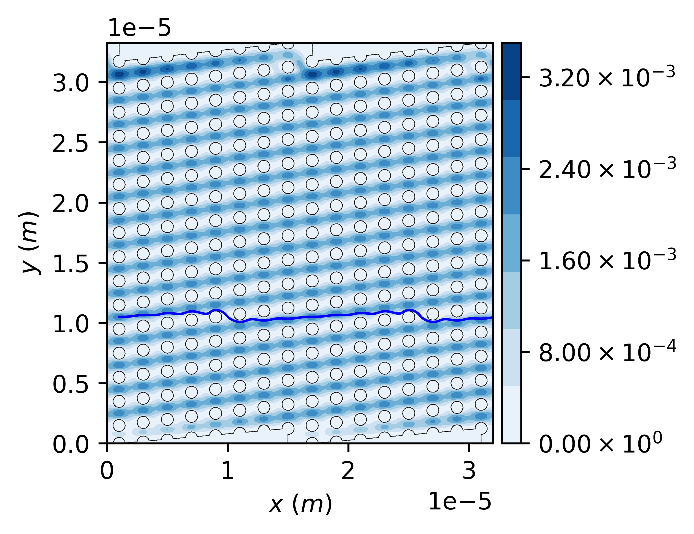

\page Example_001_dld Example #1: Injecting one particle from a point source into a microfluidic DLD device
\tableofcontents 

# Overview

The files for this example can be found in `pt/docs/examples/dld_01`.
This example considers a deterministic lateral displacement (DLD) structure with a periodicity of $Np=8$ and a circular pillar array of diameter of $1~\mu m$ and pitch of $2~\mu m$.
More details on DLD can be found in [Huang _et. al._ (2004)](https://www.science.org/doi/10.1126/science.1094567).

The continuous phase solution fields have already been obtained through solving the fluid flow equations of motion by using Ansys Fluent package. 

# Hierarchy of directories and files
- The `./inp` directory is used to store the mesh and solution files. 
- The `./particle` directory is created before running the simulation and will be used by the library to store the particle trajectory files.
- The `./report` directory is created before running the simulation and will be used by the library to store the report files as needed.

# Configuration file

Navigate to the directory `pt/docs/examples/dld_01`. 
Inspect the configuration file named `config` and review the comments included in the file that aims at explaining the structure of the file and the purpose of using each parameter.

The configuration file is set up for the case of injecting a particle of diameter $100~nm$ and density of $1,000~kg/m^3$ from a position with coordinates of $(1~\mu m,~10.5~\mu m)$.

# Running particle tracking simulation

While you are in the aformentioned directory in your terminal, run:

```
pt -f config
```

The particle tracking will be completed in about a minute or so based on your computer specifications.
The particle trajectory file shoule be accessible from the `./particle` directory.
Here are some of the results:



\image latex Example_001_dld_res_00.png "Trajectory of particle obtained by using the library." width=\textwidth
