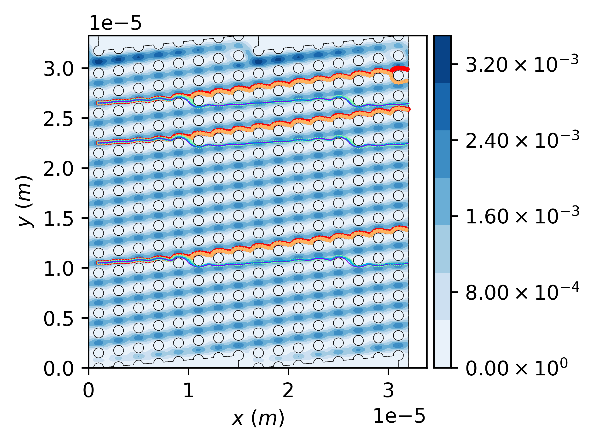

\page Example_004_dld Example #4: Configuring particles to be injected from different locations into a microfluidic DLD device
\tableofcontents 

# Overview

The files for this example can be found in `pt/docs/examples/dld_04`.
This example considers a microfluidic DLD structure with a periodicity of $Np=8$ and a circular pillar array of diameter of $1~\mu m$ and pitch of $2~\mu m$.

The continuous phase solution fields have already been obtained through solving the fluid flow equations of motion by using Ansys Fluent package. 

# Hierarchy of directories and files
- The `./inp` directory is used to store the mesh and solution files as well as a file to configure particles to be injected. Make sure you copy the mesh and solution files from `pt/docs/examples/dld_01/inp` into this directory.
- The `./particle` directory is created before running the simulation and will be used by the library to store the particle trajectory files.
- The `./report` directory is created before running the simulation and will be used by the library to store the report files as needed.

# Configuration file

Navigate to the project directory. 
Inspect the configuration file named `config` and review the comments included in the file that aims at explaining the structure of the file and the purpose of using each parameter.

The configuration file `./config` is set up for the case of injecting 15 particles according to the following configurations, consisting of two injection mechanisms: 1. point source injection configured using the `./config` file, and 
2. specifying the particle configuration file within the `./config` file enabling the particles to be configured using the specified config file residing within the `./inp` directory, _i.e._, `./inp/config_particles`.

- **Point source:** 5 particles of diameter $100~nm,~200~nm,~300~nm,~400~nm,~\text{and}~500~nm$ and density of $1,000~kg/m^3$ to be injected from a position with coordinates of $(1~\mu m,~10.5~\mu m)$.

- **Particle configuration file:** 5 particles of diameter $100~nm,~200~nm,~300~nm,~400~nm,~\text{and}~500~nm$ and density of $1,000~kg/m^3$ to be injected from a position with coordinates of $(1~\mu m,~22.5~\mu m)$.

- **Particle configuration file:** 5 particles of diameter $100~nm,~200~nm,~300~nm,~400~nm,~\text{and}~500~nm$ and density of $1,000~kg/m^3$ to be injected from a position with coordinates of $(1~\mu m,~26.5~\mu m)$.

# Running particle tracking simulation

While you are in the aformentioned directory in your terminal, run:

```
pt -f config
```

The particle tracking will be completed in about a minute or so based on your computer specifications.
The particle trajectory files shoule be accessible from the `./particle` directory.
Some of the results are shown in the following.

> [!NOTE]
> It can be discerned that particle trajectory changes from zig-zag mode at small diameters to bumping mode at sufficiently large diameters.



\image latex Example_004_dld_res_00.png "Trajectory of particles obtained by using the library." width=\textwidth