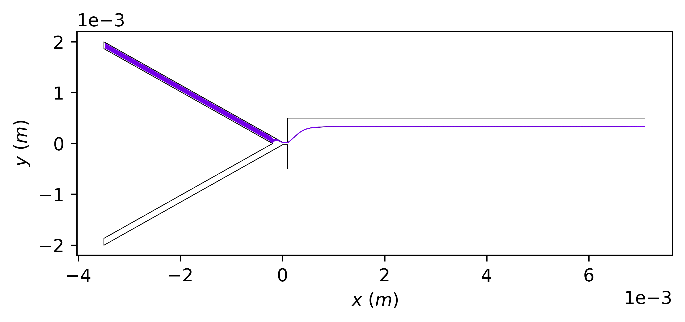

\page Example_005_pinched Example #5: Configuring particles on a streakline to be injected into a microfluidic device with pinched flow
\tableofcontents 

# Overview

The files for this example can be found in `pt/docs/examples/pinched_01`.
This example considers a microfluidic DLD structure with a pinched flow similar to that reported by [Yamada _et. al._ (2004)](https://pubs.acs.org/doi/10.1021/ac049863r).

The continuous phase solution fields have already been obtained through solving the fluid flow equations of motion by using Ansys Fluent package. 

# Hierarchy of directories and files
- The `./inp` directory is used to store the mesh and solution files. 
- The `./particle` directory is created before running the simulation and will be used by the library to store the particle trajectory files.
- The `./report` directory is created before running the simulation and will be used by the library to store the report files as needed.

# Configuration file

Navigate to the project directory. 
Inspect the configuration file named `config` and review the comments included in the file that aims at explaining the structure of the file and the purpose of using each parameter.

The configuration file is set up for the case of injecting 10 particles of diameter $15~\mu m$ and density of $1,000~kg/m^3$ on a streakline connecting two points of $(-3.475~mm,~1.875~mm)$ and $(-3.475~mm,~1.970~mm)$.

# Running particle tracking simulation

While you are in the aformentioned directory in your terminal, run:

```
pt -f config
```

The particle tracking will be completed in about a minute or so based on your computer specifications.
The particle trajectory files shoule be accessible from the `./particle` directory.
Here are some of the results:

> [!NOTE]
> It can be discerned that particles follow an almost identical streamline when moving through the pinched segment and consequently through the broadened segment of channel. 



\image latex Example_005_pinched_res_00.png "Trajectory of particles obtained by using the library." width=\textwidth