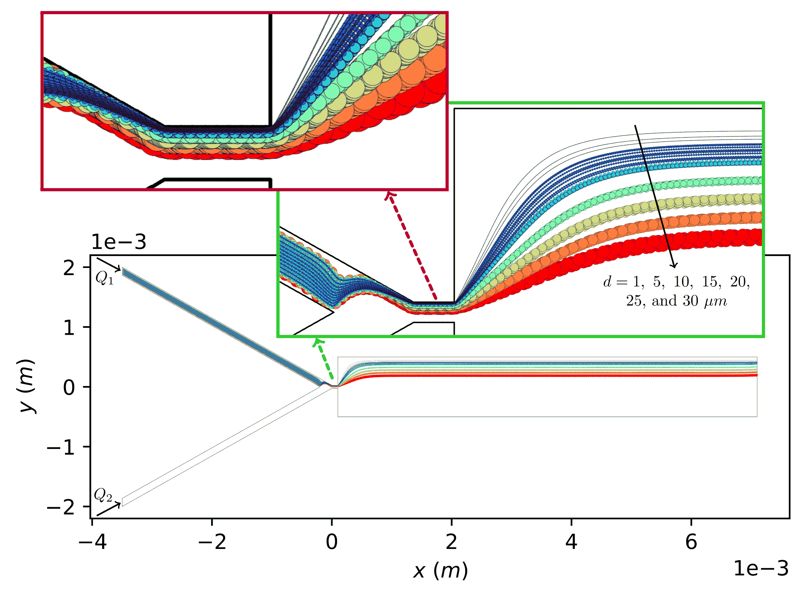

\page Example_006_pinched Example #6: Configuring particles from a file to be injected from different locations into a microfluidic device with pinched flow
\tableofcontents 

# Overview

The files for this example can be found in `pt/docs/examples/pinched_02`.
This example considers a microfluidic DLD structure with a pinched flow similar to that reported by [Yamada _et. al._ (2004)](https://pubs.acs.org/doi/10.1021/ac049863r).

The continuous phase solution fields have already been obtained through solving the fluid flow equations of motion by using Ansys Fluent package. 

# Hierarchy of directories and files
- The `./inp` directory is used to store the mesh and solution files as well as a file to configure particles to be injected. Make sure you copy the mesh and solution files from `pt/docs/examples/pinched_01/inp` into this directory.
- The `./particle` directory is created before running the simulation and will be used by the library to store the particle trajectory files.
- The `./report` directory is created before running the simulation and will be used by the library to store the report files as needed.

# Configuration file

Navigate to the project directory. 
Inspect the configuration file named `config` and review the comments included in the file that aims at explaining the structure of the file and the purpose of using each parameter.

The configuration file is set up for the case of injecting 77 particles configured as 7 sets of particles of diameter $1~\mu m,~5~\mu m,~10~\mu m,~15~\mu m,~20~\mu m,~25~\mu m,~\text{and}~30~\mu m$ released from a line connecting two points of $(-3.475~mm,~1.87~mm)$ and $(-3.475~mm,~1.970~mm)$, each set consisting of 11 particles. 
The density of particles is $1,000~kg/m^3$.

# Running particle tracking simulation

While you are in the aformentioned directory in your terminal, run:

```
pt -f config
```

The particle tracking will be completed in about a minute or so based on your computer specifications.
The particle trajectory files shoule be accessible from the `./particle` directory.
Here are some of the results:

> [!NOTE]
> It can be discerned that sufficiently-large particles follow almost identical size-dependent streamlines when moving through the pinched segment and consequently through the broadened segment of channel.
> This behavior can be explained by considering the fact that particles become confined to a limited space in proximity of a sidewall within the pinched segment. The center of particles with radii larger than a threshold falls outside of particle-containing stream within the pinched segment. As a result of being pressed against a sidewall of pinched segment, these particles are sorted along the sidewall following distinct particle size-dependent streamlines, which diverge within the expanded region enabling high-resolution separation of particles.



\image latex Example_006_pinched_res_00.png "Trajectory of particles obtained by using the library." width=\textwidth
